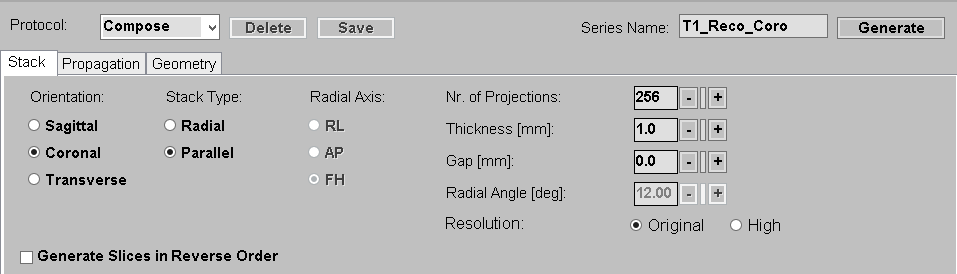
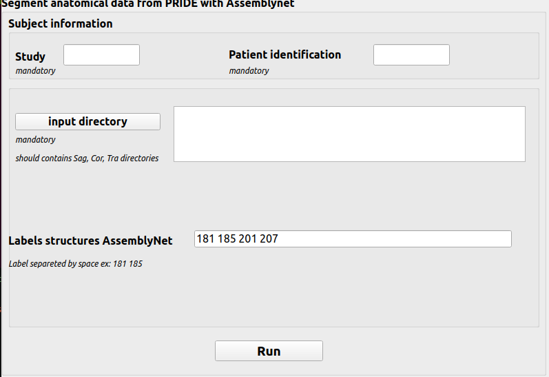

# segment-from-pride

Allows to externally process scans (here segment using AssemblyNet) exported with the Philips PRIDE tool and import the result back in the Philips console.

**Available under GNU GENERAL PUBLIC LICENSE Version 3**

# Disclaimer 
The present tool is intended to be used in conjunction with the PRIDE tool from Philips. 
To do so, it reads and writes XML/REC files through the `xmlrec.py` code developed by Philips.
The present code will not run without this code. Please get in touch with your Philips clinical scientist to access PRIDE and the required library.

# Requirements
- Developed with Python 3.8, but should run with more recent versions.
- `xmlrec.py`, as indicated above.
- AssemblyNet, ran through a docker as indicated in their [documentation](https://github.com/volBrain/AssemblyNet). The user running the code must have the appropriate priviledges to launch a docker.
- python packages: `pyQt5`, `os`, `glob`, `numpy`, `nibabel` and `subprocess`

# How to use
## PRIDE
- Create a `InlineExportXML` directory in `G:\Patch\PRIDE` (or equivalent on your system) and place the `inlineExportXML.pl` file there.
- Edit the `dirXmlRecIn`, `adirXmlRecPost` and `dirXmlRecOut` variables ot suit your system.
- Place the InlmineExportXML.xml in the `G:\Patch\PRIDE\packageconfiguration` directory.
- When calling PRIDE to export data, a NotePad window will open. Data will only be imported back in the console from `dirXmlRecOut` when this NotePad window is closed.
- Once imported by PRIDE, the images can be used in scan planning by pulling them from the "Thumbnail view".

## Acquisition
- Acquire a T1w scan with square in-plane resolution (e.g. sagittal 256x256 in-plane res.).
- In volume view, produce three images, one for each orientation. They must be isotropic with cubic volumes. Here is how to proceed:
  - Use the "original" resolution mode when asked (not "high"). This will keep the in-plane res. in all produced volumes.
  - Set the number of projections to match the in-plane res. of the original scan. For example, 256 projections for a 256x256 original scan.  
The aim is to obtain three XML/REC with proper geometry information. See the image below.


- Using PRIDE, export these three images in separate directories called "Sag", "Cor" and "Tra".
  
## Segment images (Python module)

### Configuration 
If it is the firt time you use this module, you need to configure your `config/config.json` by adding the following path in the file:

- OutDirectory = out directory path, the processing will be added in OutputDirectory/studyname/patientname

You should add the `xmlrec.py` (see below) in the directory `/segment-from-pride/segment-from-pride`.

### Launch the module without arguments

```bash
python /segment-from-pride/segment-from-pride/main.py
```
The following window will appear:



- Fill "Study" and "Patient identification"

- Click on "input directory" and choose the directory with the acqusitions expoted from PRIDE (where "Sag", "Cor" and "Tra" directories are located)

- Fill the "Labels structures AssemblyNet" field with the AssemblyNet labels you want to extract (labels correspondences can be found [here](https://github.com/volBrain/AssemblyNet/blob/main/example/README.pdf) in the "structures" part)

- Click on "Run"

The code runs on its own from there and produces 3 XML/REC in `OutDirectory/studyname/patientname` which can be imported back in the console with a single PRIDE call (copy the 6 files in the `dirXmlRecOut`, see below).

### Launch the module with arguments

```bash
python /segment-from-pride/segment-from-pride/main.py --input path/to/pride/acq --labels 181 185 --study studyname --patient patientname
```
The code runs on its own from there and produces 3 XML/REC in `OutDirectory/studyname/patientname` which can be imported back in the console with a single PRIDE call (copy the 6 files in the `dirXmlRecOut`, see below).
  
# Possible improvements
- Producing three cubic volumes allows to obtain XML files with correct geometry information, which avoids computing all the offcenters from the sagittal scan. There may be a cleaner wat with fewer PRIDE exports to implement. 
